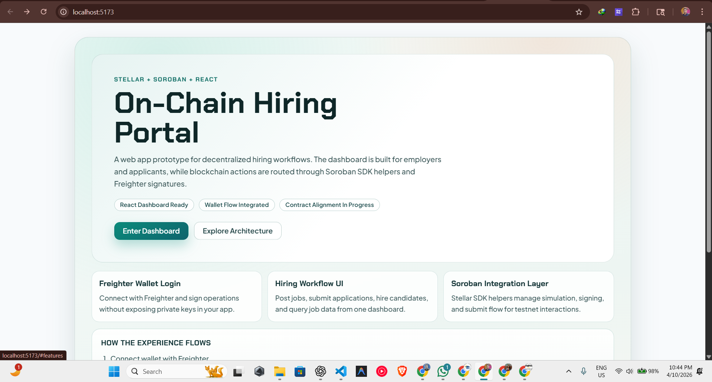
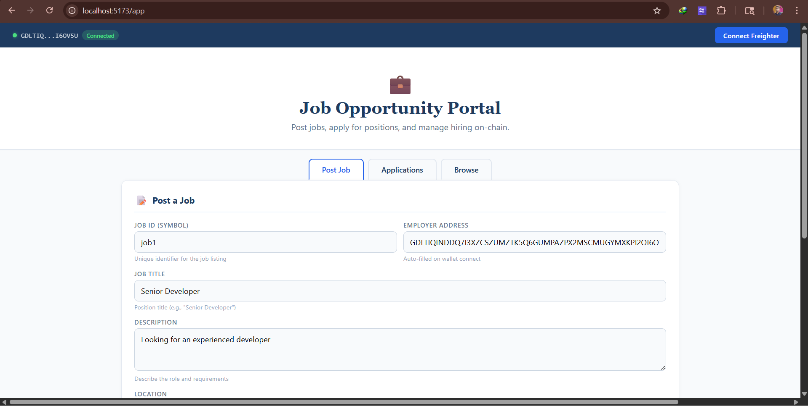
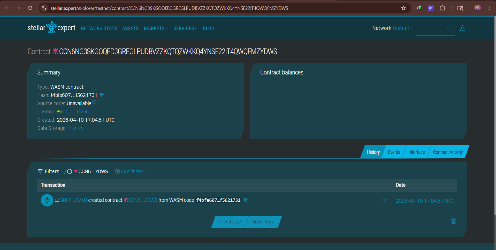

# Stellar Soroban Hiring Portal (Project Analysis)

This repository is a Vite + React frontend and a Soroban Rust contract workspace aimed at building an on-chain hiring portal on Stellar testnet.

The app currently includes a landing page and a dashboard flow for:
- wallet connection with Freighter
- posting jobs
- applying to jobs
- hiring applicants
- querying jobs and application counts

## Screenshots

### Landing Page



### Job Portal Dashboard



### Contract on Stellar Expert



## Analysis Snapshot

After reviewing the codebase, this is the current state:

1. Frontend app direction: **Job portal**
	- `src/App.jsx` is built around job actions (`postJob`, `applyJob`, `closeJob`, `hireApplicant`, query operations).

2. Smart contract direction: **Record management**
	- `contract/contracts/src/lib.rs` exposes record operations (`create_record`, `update_record`, `archive_record`, etc.).

3. Integration mismatch exists
	- `lib/stellar.js` calls contract methods like `post_job` and `apply_job`, which do not match the Rust contract functions in this repository.

4. Build health
	- Frontend now builds successfully with Vite.
	- Current build output is large (main JS bundle is over 500 kB minified), so code-splitting should be considered.

This means the UI concept is strong, but on-chain interface alignment is still needed for reliable end-to-end contract calls.

## Tech Stack

- React 19
- Vite 8
- Stellar SDK (`@stellar/stellar-sdk`)
- Freighter API (`@stellar/freighter-api`)
- Soroban smart contracts (Rust)

## Project Structure

```text
.
├── contract/
│   ├── Cargo.toml
│   ├── README.md
│   └── contracts/
│       ├── Cargo.toml
│       ├── Makefile
│       └── src/
│           ├── lib.rs
│           └── test.rs
├── lib/
│   └── stellar.js
├── public/
├── src/
│   ├── App.jsx
│   ├── LandingPage.jsx
│   ├── App.css
│   ├── LandingPage.css
│   ├── index.css
│   └── main.jsx
├── index.html
├── package.json
└── vite.config.js
```

## Getting Started

### Prerequisites

- Node.js 18+
- npm
- Freighter wallet extension

### Install

```bash
npm install
```

### Run Development Server

```bash
npm run dev
```

Open `http://localhost:5173`.

### Production Build

```bash
npm run build
npm run preview
```

## Scripts

- `npm run dev` - start local Vite dev server
- `npm run build` - create production build
- `npm run preview` - preview production build locally
- `npm run lint` - run ESLint

## Contract / Network Configuration

Frontend contract settings are in `lib/stellar.js`:
- `CONTRACT_ID`
- `RPC_URL`
- `NETWORK_PASSPHRASE`

If you deploy a new contract, update these values accordingly.

## Contract Explorer Link

- Testnet contract: [https://stellar.expert/explorer/testnet/contract/CCN6NG3SKGOQED3GREGLPUDBVZZKQTQZWKKQ4YNSE22IT4QWQFMZYDWS](https://stellar.expert/explorer/testnet/contract/CCN6NG3SKGOQED3GREGLPUDBVZZKQTQZWKKQ4YNSE22IT4QWQFMZYDWS)

## Recommended Next Step

Choose one path and align all layers:

1. Keep the **hiring portal** concept
	- Update Rust contract methods/storage model to support jobs and applications.

2. Keep the **record management** contract
	- Refactor frontend forms and actions to call record endpoints.

Once this alignment is complete, end-to-end on-chain actions from UI will be reliable.
